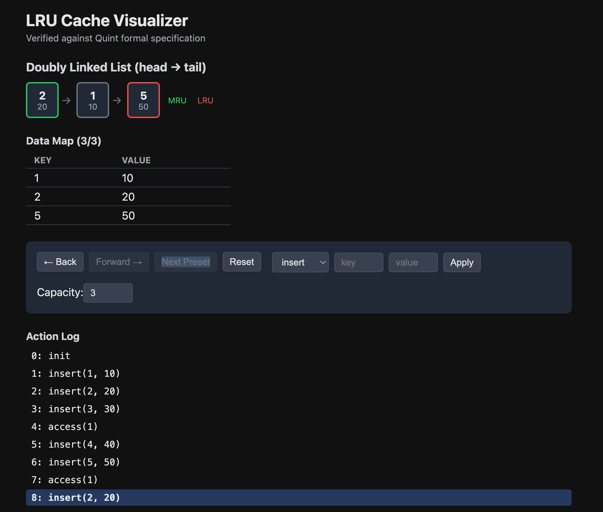

# LRU Cache Viz

LRU cache where the only human-reviewed code is the [Quint spec](lru_cache.qnt). The TypeScript implementation and UI are LLM-generated. Correctness is proven with [Quint](https://github.com/informalsystems/quint) and [`quint-connect`](https://github.com/nicefirefi/quint-connect).



## Trust boundary

| Layer | Status |
|-------|--------|
| `lru_cache.qnt` | LLM-written, human-verified formal spec |
| `packages/core/` | LLM-generated TS, verified against spec by quint-connect |
| `packages/ui/` | LLM-generated React viz, display only |

## How it works

1. `lru_cache.qnt` defines an LRU cache with a doubly linked list in Quint (TLA+-based spec language)
2. `packages/core/` is a direct TS translation of the spec's pure functions
3. `pnpm test` runs `quint run --mbt` to generate random execution traces from the spec, then replays each trace through the TS implementation, comparing all state (hd, tl, data, nxt, prv) at every step
4. Any divergence between spec and implementation fails the test

## Run

```bash
pnpm install
pnpm test          # prove TS matches spec
pnpm dev           # launch visualizer
```
